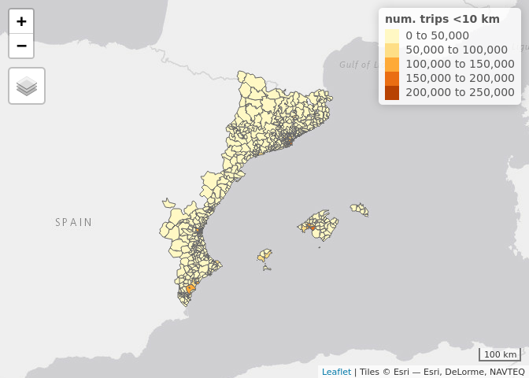

open-data-movilidad
================

This repository contains code to access OD data (based on mobile phones
locations) from the Ministry of Transport, Mobility and Urban Agenda
(Spain).

The raw data and some information on the method used to collect the data
can be found in the link below. (Do not use Chromium to open the link or
you won’t be able to see the data!)

<https://www.mitma.gob.es/ministerio/covid-19/evolucion-movilidad-big-data/opendata-movilidad>

``` r
# Read the data
dist_202102 = read.table(gzfile("datos/202102_maestra1_mitma_distrito/20210201_maestra_1_mitma_distrito.txt.gz"), header = TRUE, sep = "|")

head(dist_202102)
##      fecha   origen  destino actividad_origen actividad_destino residencia edad
## 1 20210201 01001_AM 01001_AM             casa             otros          1   NA
## 2 20210201 01001_AM 01001_AM             casa             otros          1   NA
## 3 20210201 01001_AM 01001_AM             casa             otros          1   NA
## 4 20210201 01001_AM 01001_AM             casa             otros          1   NA
## 5 20210201 01001_AM 01001_AM             casa             otros          1   NA
## 6 20210201 01001_AM 01001_AM             casa             otros          1   NA
##   periodo distancia viajes viajes_km
## 1       0   002-005 13.241    50.442
## 2       0   010-050  8.542   112.803
## 3       1   002-005 13.241    60.358
## 4       2   005-010  8.542    48.744
## 5       3   005-010 13.241    86.924
## 6       3   010-050 13.241   255.191

dist_202102_2 = read.table(gzfile("datos/202102_maestra2_mitma_distrito/20210201_maestra_2_mitma_distrito.txt.gz"), header = TRUE, sep = "|")

names(dist_202102_2)
## [1] "fecha"         "distrito"      "numero_viajes" "personas"

muni_202102 = read.table(gzfile("datos/202102_maestra1_mitma_municipio/20210201_maestra_1_mitma_municipio.txt.gz"), header = TRUE, sep = "|")

names(muni_202102)
## [1] "fecha"     "origen"    "destino"   "periodo"   "distancia" "viajes"   
## [7] "viajes_km"

muni_202102_2 = read.table(gzfile("datos/202102_maestra2_mitma_municipio/20210201_maestra_2_mitma_municipio.txt.gz"), header = TRUE, sep = "|")

names(muni_202102_2)
## [1] "fecha"         "distrito"      "numero_viajes" "personas"

muni = read.table("relaciones_municipio_mitma.csv", header = TRUE, sep = "|")
dist = read.table("relaciones_distrito_mitma.csv", header = TRUE, sep = "|")

zonificacion_dist <- sf::st_read(
  "zonificacion_distritos/zonificacion-distritos/distritos_mitma.shp")
## Reading layer `distritos_mitma' from data source 
##   `/home/eugeni/Documents/open-data-movilidad/zonificacion_distritos/zonificacion-distritos/distritos_mitma.shp' 
##   using driver `ESRI Shapefile'
## Simple feature collection with 2850 features and 1 field
## Geometry type: MULTIPOLYGON
## Dimension:     XY
## Bounding box:  xmin: -1004502 ymin: 3132130 xmax: 1126931 ymax: 4859240
## Projected CRS: ETRS89_UTM_zone_30N_N_E

zonificacion_muni <- sf::st_read(
  "zonificacion_municipios/zonificacion-municipios/municipios_mitma.shp")
## Reading layer `municipios_mitma' from data source 
##   `/home/eugeni/Documents/open-data-movilidad/zonificacion_municipios/zonificacion-municipios/municipios_mitma.shp' 
##   using driver `ESRI Shapefile'
## Simple feature collection with 2205 features and 1 field
## Geometry type: MULTIPOLYGON
## Dimension:     XY
## Bounding box:  xmin: -1004502 ymin: 3132130 xmax: 1126931 ymax: 4859240
## Projected CRS: ETRS89_UTM_zone_30N_N_E

# codpro = read.table("codpro.csv", header = TRUE, sep = ",", check.names = F)
```

``` r
plot(zonificacion_dist)
```

<!-- -->
