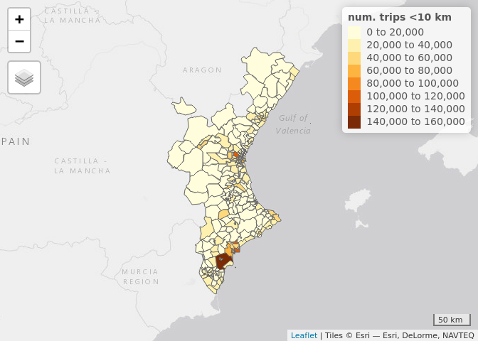

open-data-movilidad
================

This repository contains code to access OD data (based on mobile phones
locations) from the Ministry of Transport, Mobility and Urban Agenda
(Spain).

The raw data and some information on the method used to collect the data
can be found in the link below. (Do not use Chromium to open the link or
you won’t be able to see the data!)

If this data is periodically updated, it may be worth it to create a
data r package.

<https://www.mitma.gob.es/ministerio/covid-19/evolucion-movilidad-big-data/opendata-movilidad>

``` r
# Read the data
dist_202102 = read.table(gzfile("datos/202102_maestra1_mitma_distrito/20210201_maestra_1_mitma_distrito.txt.gz"), header = TRUE, sep = "|")
head(dist_202102)
##      fecha   origen  destino actividad_origen actividad_destino residencia edad
## 1 20210201 01001_AM 01001_AM             casa             otros          1   NA
## 2 20210201 01001_AM 01001_AM             casa             otros          1   NA
## 3 20210201 01001_AM 01001_AM             casa             otros          1   NA
## 4 20210201 01001_AM 01001_AM             casa             otros          1   NA
## 5 20210201 01001_AM 01001_AM             casa             otros          1   NA
## 6 20210201 01001_AM 01001_AM             casa             otros          1   NA
##   periodo distancia viajes viajes_km
## 1       0   002-005 13.241    50.442
## 2       0   010-050  8.542   112.803
## 3       1   002-005 13.241    60.358
## 4       2   005-010  8.542    48.744
## 5       3   005-010 13.241    86.924
## 6       3   010-050 13.241   255.191
# dist_202102_2 = read.table(gzfile("datos/202102_maestra2_mitma_distrito/20210201_maestra_2_mitma_distrito.txt.gz"), header = TRUE, sep = "|")
# names(dist_202102_2)
# muni_202102 = read.table(gzfile("datos/202102_maestra1_mitma_municipio/20210201_maestra_1_mitma_municipio.txt.gz"), header = TRUE, sep = "|")
# names(muni_202102)
# muni_202102_2 = read.table(gzfile("datos/202102_maestra2_mitma_municipio/20210201_maestra_2_mitma_municipio.txt.gz"), header = TRUE, sep = "|")
# names(muni_202102_2)

dist = read.table("relaciones_distrito_mitma.csv", header = TRUE, sep = "|")
# muni = read.table("relaciones_municipio_mitma.csv", header = TRUE, sep = "|")

zonificacion_dist <- sf::st_read(
  "zonificacion_distritos/zonificacion-distritos/distritos_mitma.shp")
## Reading layer `distritos_mitma' from data source 
##   `/home/eugeni/Documents/open-data-movilidad/zonificacion_distritos/zonificacion-distritos/distritos_mitma.shp' 
##   using driver `ESRI Shapefile'
## Simple feature collection with 2850 features and 1 field
## Geometry type: MULTIPOLYGON
## Dimension:     XY
## Bounding box:  xmin: -1004502 ymin: 3132130 xmax: 1126931 ymax: 4859240
## Projected CRS: ETRS89_UTM_zone_30N_N_E
# zonificacion_muni <- sf::st_read(
#   "zonificacion_municipios/zonificacion-municipios/municipios_mitma.shp")

cod_pro = read.table("cod_ccaa_pro.csv", header = TRUE, sep = ",")
```

``` r
# create province and district origin
dist_202102 = dist_202102 %>% 
  # slice_head(n = 10) %>%
  separate(origen, into = c("prov_O", "dist_O"), sep = 2, remove = FALSE)  

# filter potetial cyclable trips (< 10km) and group by district
dist_202102 = dist_202102 %>% 
  filter(distancia == "002-005" | distancia == "005-010") %>% 
  group_by(origen, prov_O, dist_O) %>% 
  summarise("num. trips <10 km"= sum(viajes))
## `summarise()` has grouped output by 'origen', 'prov_O'. You can override using
## the `.groups` argument.

# add geometry and province and region tags
dist_202102 = dist_202102 %>% 
  left_join(zonificacion_dist, by = c("origen" = "ID"))
dist_202102$prov_O = as.numeric(dist_202102$prov_O)
dist_202102 = dist_202102 %>% 
  left_join(cod_pro, by = c("prov_O" = "Cod_Provincia"))

table(dist_202102$Nom_CCAA)
## 
##                          CIUDAD DE CEUTA 
##                                        6 
##                        CIUDAD DE MELILLA 
##                                        7 
##          COMUNIDAD AUTONOMA DE ANDALUCIA 
##                                      504 
##             COMUNIDAD AUTONOMA DE ARAGON 
##                                      100 
##           COMUNIDAD AUTONOMA DE CANARIAS 
##                                       97 
##          COMUNIDAD AUTONOMA DE CANTABRIA 
##                                       52 
##    COMUNIDAD AUTONOMA DE CASTILLA Y LEON 
##                                      247 
## COMUNIDAD AUTONOMA DE CASTILLA-LA MANCHA 
##                                      196 
##           COMUNIDAD AUTONOMA DE CATALUNA 
##                                      440 
##        COMUNIDAD AUTONOMA DE EXTREMADURA 
##                                      111 
##            COMUNIDAD AUTONOMA DE GALICIA 
##                                      213 
##      COMUNIDAD AUTONOMA DE ILLES BALEARS 
##                                       55 
##           COMUNIDAD AUTONOMA DE LA RIOJA 
##                                       25 
##        COMUNIDAD AUTONOMA DEL PAIS VASCO 
##                                      139 
##                      COMUNIDAD DE MADRID 
##                                      161 
##               COMUNIDAD FORAL DE NAVARRA 
##                                       63 
##                     COMUNIDAD VALENCIANA 
##                                      295 
##                   PRINCIPADO DE ASTURIAS 
##                                       63 
##                         REGION DE MURCIA 
##                                       56

# make map plottable
dist_202102 = st_sf(dist_202102)
```

``` r
# filter Valencian Country
dist_202102_CV = dist_202102 %>% 
   filter(Nom_CCAA == "COMUNIDAD VALENCIANA")

# plot map
qtm(dist_202102_CV, "num. trips <10 km")
```

<!-- -->

*Fig 1: Number of trips under 10 km by district (during February 2021)
Valencian Country*
